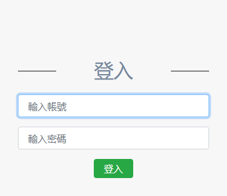
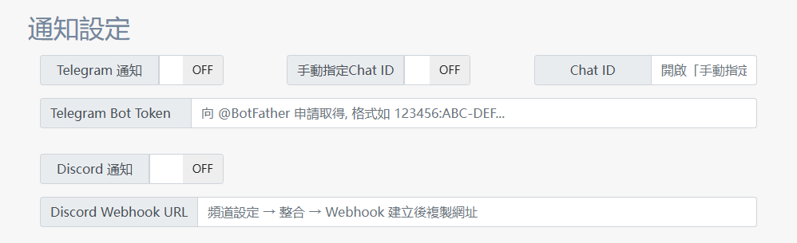
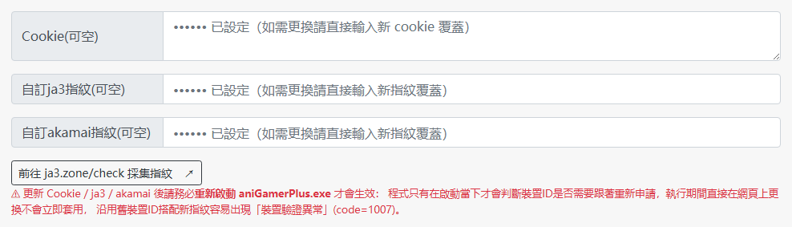
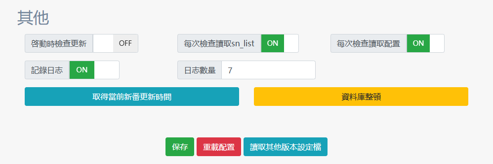
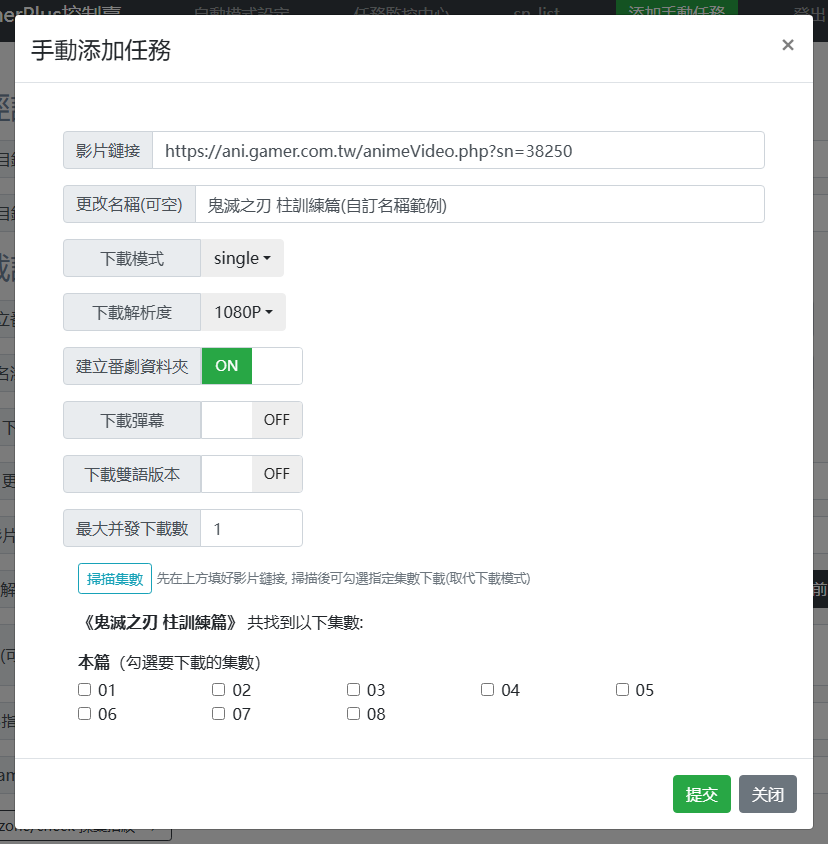
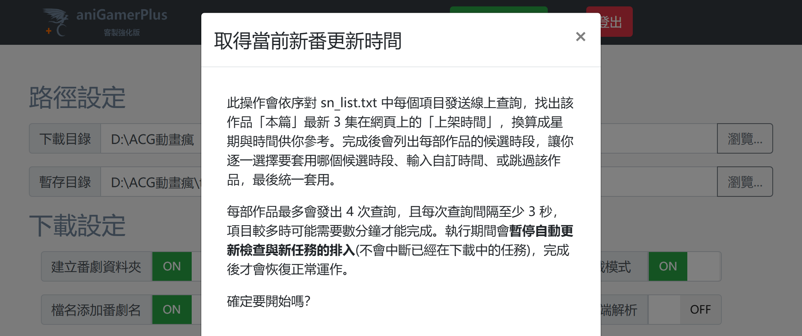
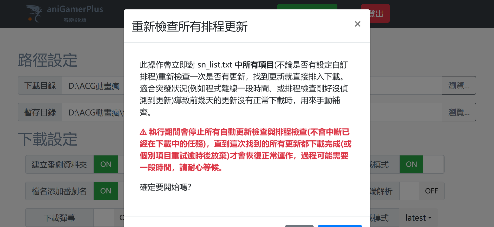
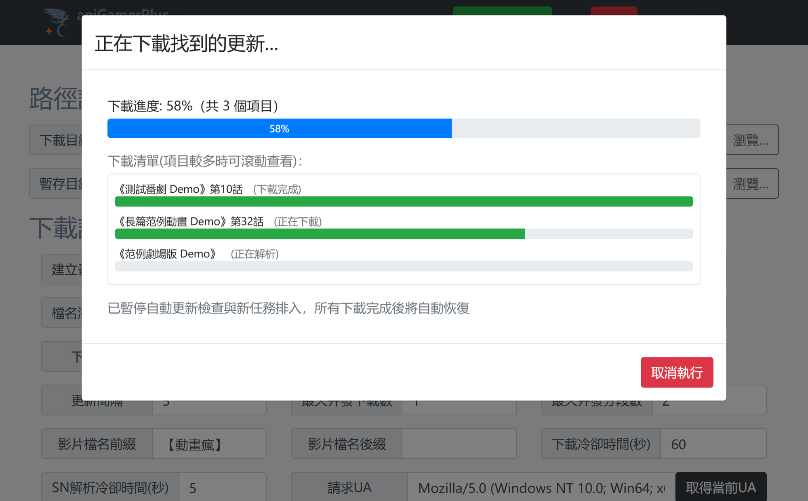
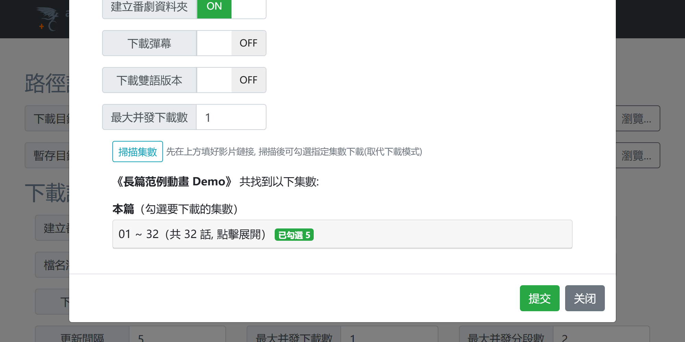

# aniGamerPlus（客製強化版）

> 以官方 [miyouzi/aniGamerPlus v24.6](https://github.com/miyouzi/aniGamerPlus/releases/tag/v24.6) 原始碼為基準的客製修改版本，目前版本為 **v25.1.5**。
> 本文件整理與官方 v24.6 的完整功能差異、新功能用法與好處，以及修正的 BUG／缺陷，方便使用者評估是否要切換使用。

官方 v24.6 之後（v24.7 ~ v25.0）自行發布的其他更新內容不包含在本次比較範圍內，以下僅列出**本客製版**相對於 **v24.6** 的變更。

---

## 一、新功能與改善

### 1. 反爬蟲與連線架構升級

原本 v24.6 使用的 `pyhttpx` 套件已停止維護。本版改用 [`curl_cffi`](https://github.com/lexiforest/curl_cffi) 重寫底層連線層，並統一套用到裝置驗證、token 取得、影片解鎖等**所有** Web API 請求，避免同一個下載流程中前後出現不一致的連線指紋而被判定為異常行為。

| 功能 | 用法 | 帶來的好處 |
|---|---|---|
| 自訂 `ja3` / `akamai` 指紋 | Dashboard 設定頁的「反爬蟲設定」區塊，或直接編輯 `config.json` 的 `ja3` / `akamai` 欄位。到 [ja3.zone/check](https://ja3.zone/check)（用你平常拿 cookie 的同一個瀏覽器打開）取得字串後貼上，**兩個欄位必須同時填寫**才會生效，只填一個會顯示警示並自動退回內建指紋 | 讓連線指紋貼近真實瀏覽器，比 curl_cffi 內建的固定罐頭指紋更不容易被大量使用者共用、集體被標記 |
| 裝置 ID 持久化 | 無需操作，程式自動產生後存成根目錄的 `device_id.txt`，之後每次下載/重試都沿用同一組 | v24.6 每次下載或重試都會跟伺服器要一組新的裝置身分，短時間內產生大量「不同裝置」的異常使用紀錄；持久化後大幅降低被風控盯上的機率 |

> ⚠️ 說明：以上為連線架構層級的強化，**不代表已徹底解決 cookie 過期問題**——curl_cffi 版本更新滯後、與官方防護策略的長期拉鋸仍可能造成 cookie 提前失效，此問題仍在觀察與處理中，不列入下方「BUG 修正」範圍。

### 2. 檔名自動清理

| 項目 | 說明 | 減少的問題 |
|---|---|---|
| 清除殘留標籤 | 標題尾端多餘的 `[...]` 標籤（例如 `[年齡限制版]`）自動清除，支援多層疊加標籤同時清除 | v24.6 會把這些標籤原封不動存進檔名，造成檔名冗長或和其他集數命名不一致 |
| 劇場版不再加註 `[電影]` | 自動判斷劇場版類型後不再附加標記 | 避免劇場版檔名與其他正篇作品命名風格不一致 |
| 特別篇不再加註 `[特別篇]` | 同上 | 同上 |

### 3. `sn_list.txt` 排程功能強化

新增**自訂星期／時間排程**語法，格式為 `*星期* $HH:MM$`，兩者必須同時填寫才生效，例如：

```
49937 <女性向遊戲世界對路人角色很不友好 第二季> *五* $23:30$ # 每週五23:30才主動檢查
```

**用法與好處**：加了這個標籤的項目，會被獨立移出「每次全數檢查」的隊伍，改由專屬背景執行緒只在每週五 23:30 起算 10 分鐘的視窗內主動檢查一次。對於固定時間更新的番剧，可以：
- 避免這類項目繼續被排進逐一輪詢的隊伍，拖慢 `sn_list.txt` 項目較多時其他作品的檢查間隔
- 避免在非更新時段對伺服器發出無意義的重複請求

其他強化：

| 項目 | 說明 |
|---|---|
| 同行重複標籤偵測 | 同一行內 `<>`、`**`、`$$` 標籤重複出現時視為設定錯誤，該標籤會被忽略並顯示警示，避免誤判排程或改名規則 |
| sn 移除後自動清資料庫 | 當某個 sn 從 `sn_list.txt` 移除、且沒有其他項目仍在追蹤同一作品時，自動清除該作品在 `aniGamer.db` 中的所有集數紀錄（僅清資料庫紀錄，**不會刪除已下載的檔案**），避免日後改番號重新追蹤時被舊紀錄誤判為「已下載過」而跳過 |

### 4. Web 控制面板（Dashboard）

| 功能 | 用法 | 好處 |
|---|---|---|
| CSRF 防護 | 無需操作，`/uploadConfig`、`/manualTask`、`/sn_list` 等會驗證 `X-Requested-With` 標頭 | 降低面板對外開放時被第三方網頁誘導發出惡意請求的風險 |
| 未設密碼時的警告 | 面板開放外部訪問但未啟用密碼保護時，啟動時主動顯示警告 | 提醒使用者避免面板在無密碼保護下直接暴露在公網 |
| 「下載雙語版本」開關 | 手動新增任務時勾選（預設關閉） | 開啟後可排除中文配音／中文電影等額外語言版本，避免重複下載不需要的語言版本，節省儲存空間與頻寬 |
| 任務進度條更新頻率優化 | 無需操作 | WebSocket 推送頻率由 1 秒優化為 0.3 秒，進度顯示更即時、不再有卡頓感 |
| 修繕早期網頁文件：自訂登入頁 | `login.html`／`register.html` 原本是專案裡從未被路由接上的早期遺留文件，密碼保護實際上一直是瀏覽器原生 HTTP Basic Auth 彈出視窗；開啟 `dashboard.BasicAuth` 後訪問面板會導向真正接上功能的自訂登入頁輸入帳號密碼（沿用 `dashboard.username`／`dashboard.password`），登入狀態以 session 保存 | 取代原本瀏覽器原生彈出的 HTTP Basic Auth 視窗，體驗更一致；登入狀態伺服器端保存，重啟程式不會被強制登出 |
| 完善早期代碼：Discord／Telegram 通知設定頁 | Discord／Telegram 通知的推送邏輯本來就是早期就寫好的功能，但 Dashboard 網頁一直沒有對應設定介面，只能手動編輯 `config.json`；這次補上「通知設定」區塊，可直接開關並填寫 Bot Token／Chat ID／Webhook URL | 不用再手動編輯 `config.json`；Token/Webhook 等敏感欄位採遮罩顯示，不會在網頁明文回顯 |
| Cookie 編輯欄位 | 設定頁直接貼上 Cookie 並保存，遮罩顯示 | 不用再手動編輯根目錄的 `cookie.txt`；保存後自動觸發裝置ID過期偵測重新申請 |
| 讀取其他版本設定檔 | 選擇一份舊 `config.json`，比對出跟目前設定不同的項目逐一列出，預設不勾選，自行勾選要匯入的項目 | 換機或還原備份時不用逐欄位手動比對搬移；高風險欄位（影響面板連線/登入）會加上 ⚠ 二次確認 |
| 取得當前新番更新時間 | 「其他」區塊按鈕，線上查詢 sn_list.txt 各作品最新 3 集的上架時間，換算成候選星期＋時間供逐項選擇套用／自訂／跳過 | 不用再手動推算連載新番的固定更新時段，自動排程功能設定更省力 |
| 資料庫整頓 | 「其他」區塊按鈕，重新線上解析各作品名稱後清除 `aniGamer.db` 中不再追蹤的舊紀錄 | 清理資料庫殘留資料，且解析失敗時會整個中止不刪除，避免誤刪仍在追蹤的作品 |
| 手動任務暫存紀錄 | 無需操作，提交時寫入 `manual_single_tasks.json`／`manual_batch_tasks.json`，任務終結時移除 | 程式當機、斷電或被強制關閉時不會悄悄遺失手動任務，啟動時自動重新提交上次未完成的項目 |
| 掃描集數 | 手動新增任務時輸入連結後按「掃描集數」，線上查詢完整集數清單列成勾選框，依「本篇」／「中文配音」／「特別篇」分區 | 取代原本只能整批（全部/最後一集/最近上傳）下載的模式，可以精準勾選要下載的集數 |
| 掃描集數：大量集數自動摺疊 | 單一分類集數 > 20 話時，無需操作，自動切成每 100 話一個可摺疊區塊，標題即時顯示「已勾選 N」 | 長篇作品（數百集）也不會把版面撐爆按不到下方的提交按鈕；收合狀態下也能知道裡面有沒有勾選項目 |
| 任務監控頁導覽列補齊 | 無需操作，導覽列補上 sn_list、添加手動任務兩個項目，並修正一個連到不存在彈窗的死連結，也修正了跟「自動模式設定」頁字體大小比例不一致的問題 | 跟「自動模式設定」頁一致，不用切回設定頁才能操作這兩項功能 |
| ja3/akamai 自動相容性檢測與修正 | 無需操作，程式啟動與 Dashboard 存檔自訂 ja3/akamai 時自動檢測並修正其中會讓 `curl_cffi` 崩潰的 TLS 擴展編號（例如新版瀏覽器常見的擴展 41） | 避免新版瀏覽器採集到的指紋讓下載任務直接失敗；連請求當下才發生的極端情況也有自動退回內建指紋重試的防護 |
| 登出穩定性修正 | 無需操作，登出改成只有請求真正成功才跳轉頁面 | 修正透過反向代理／Cloudflare Tunnel 對外開放時，登出按鈕可能因為請求被中間層擋下而「按了沒反應」的問題 |
| Dashboard 靜態資源快取破壞 | 無需操作，CSS/JS 資源網址自動帶上版本號查詢字串 | 透過 Cloudflare 等會依副檔名快取靜態資源的服務對外開放時，更新版本後不用再手動去後台清快取，瀏覽器與邊緣節點會自動抓到最新檔案 |
| 修正偵測不到 Dashboard 資料夾時整支程式崩潰 | 無需操作，`Config.py` 內部處理設定的兩個函式不再共用同一個 dict 物件 | 修正只複製 `.exe` 忘記一併帶 `Dashboard` 資料夾時，程式會因為內部設定物件互相污染、`working_dir` 等欄位被誤刪而直接 `KeyError` 崩潰、完全無法啟動的問題 |
| **重新檢查所有排程更新**（v25.1.5） | 「其他」區塊按鈕，執行前明確告知會暫停所有自動檢查直到下載完成；按下後立即對 sn_list.txt **全部項目**重新檢查一次更新並自動排入下載，進度視窗提供總進度條＋可捲動的個別項目清單 | 程式離線一段時間、或排程檢查剛好沒偵測到更新，導致漏抓的更新不用再等到下次自動檢查或下週同一排程時段，一鍵手動補齊 |

#### Dashboard 畫面截圖

<table>
<tr>
<td width="50%">

**自訂登入頁**（取代原本瀏覽器彈出的 HTTP Basic Auth 視窗）



</td>
<td width="50%">

**通知設定**（Telegram／Discord，取代手動編輯 config.json）



</td>
</tr>
<tr>
<td width="50%">

**Cookie／ja3／akamai 指紋設定**（新增可直接編輯的 Cookie 欄位）



</td>
<td width="50%">

**「其他」工具**：取得當前新番更新時間／資料庫整頓／讀取其他版本設定檔



</td>
</tr>
<tr>
<td width="50%">

**手動任務新增「掃描集數」**（可逐集勾選要下載的項目，取代下拉選單模式）



</td>
<td width="50%">

**取得當前新番更新時間**：執行前會清楚說明行為並二次確認



</td>
</tr>
<tr>
<td width="50%">

**重新檢查所有排程更新**：執行前明確告知會暫停所有排程檢查直到下載完成（v25.1.5）



</td>
<td width="50%">

**重新檢查所有排程更新**：總進度條＋個別項目下載進度清單（v25.1.5）



</td>
</tr>
<tr>
<td colspan="2">

**掃描集數：大量集數自動摺疊**（超過 20 話自動分區摺疊，標題即時顯示已勾選數量，v25.1.5）



</td>
</tr>
</table>

### 5. 排程下載穩定性與批次補救

| 項目 | 說明 | 好處 |
|---|---|---|
| 排程下載失敗自動重試 | 自訂星期／時間排程找到更新並排入下載後，不再視為「本週結束」就不理會；會持續追蹤該集數直到真的下載成功，失敗（例如兩個排程同時觸發裝置驗證異常 `code=1007`）會自動重新排入隊列重試，最多追蹤 2 小時才放棄 | 修正過去下載途中失敗就再也不會自動重試、必須手動重啟程式才能補下載的問題，排程功能更可靠、不需要人盯著 |
| 重新檢查所有排程更新 | 詳見上方 Dashboard 功能表格與截圖 | 程式離線一段時間導致漏抓更新時，一鍵手動補齊，不用等下次自動檢查或下週同一排程時段 |

### 6. 打包與部署

- 建立本機 PyInstaller 獨立 exe 打包流程（`aniGamerPlus.exe`），免安裝 Python 環境即可直接執行
- `greenlet` / `gevent` / `lxml` 依賴版本由精確釘選改為下限版本，解決 v24.6 在 Python 3.13 環境下無法安裝依賴的問題

---

## 二、修正 v24.6 的 BUG 與缺陷

| 缺陷（v24.6 行為） | 修正後 | 影響範圍 |
|---|---|---|
| 遇到 VIP 限制、地區限制、sn 不存在等**不可能重試成功**的錯誤時，仍會當成暫時性錯誤重試 | 新增 `ForceStopError`，判斷為不可重試的致命錯誤時直接終止任務 | 避免無謂浪費重試次數與時間，任務能更快得到明確的失敗結果 |
| 執行緒內未預期的錯誤會直接印出原始 Python Traceback | 新增全域執行緒例外攔截，改為輸出中文提示訊息 | 一般使用者不需要看懂 Traceback 也能知道發生了什麼問題 |
| `anime.renew()` 在重試流程中沒有被 `try/except` 保護 | 補上例外保護 | 避免這個環節出錯時直接把整個重試流程炸掉 |
| Discord／Plex／Telegram 通知失敗時，裸 `except:` 缺少 `as e`，記錄錯誤訊息時反而觸發二次 `NameError` | 補上 `as e` | 修正前使用者看到的其實是「記錄錯誤時又出錯」的誤導訊息，看不到真正的通知失敗原因 |
| `get_local_ip()` 在裝置無網路連線時拋出 `UnboundLocalError` | 修正邏輯 | 避免在無網路環境下程式直接崩潰 |
| 主控台輸出含特定 Unicode 字元（例如 GitHub release notes 中的特殊符號）時，會讓整支程式直接崩潰退出 | 修正輸出邏輯，改為安全輸出 | 避免使用者因為官方 release notes 內容而莫名其妙整支程式關閉 |
| 版本比較邏輯遇到版本號有多個小數點（如 `v24.9.10`）時會讓更新檢查崩潰 | 修正版本號解析邏輯 | 更新檢查不再因版本號格式而中斷 |
| 自訂星期／時間排程重啟程式時，會把「本週一到今天」所有已設定排程的星期都補檢查一次 | 改為只有排程對應到「今天」且時段已過才補檢查一次，本週其他已過去的天數直接跳過 | 避免重啟後對多個排程時段一次性補發大量檢查請求 |
| 自訂排程若已過期（超過當週視窗），會直接整週跳過、完全不檢查 | 改為無論如何至少檢查一次（仍遵守 SN 解析冷卻時間） | 避免因為程式啟動時機不巧，導致該週排程形同虛設 |
| Dashboard 設定頁存檔後，頁面顯示的欄位（尤其是 ja3/akamai/UA 等）可能因瀏覽器快取沒有即時反映最新設定 | 後端回應加上 `Cache-Control: no-store`，前端讀取設定時一併禁用快取 | 存檔後頁面顯示與實際設定值保持一致，避免使用者誤以為沒存成功 |

---

## 三、容量與速度比較

本客製版真正的強項，是**放著長時間無人看管也能穩定把番劇準時抓下來**：裝置身分持久化、異常自動重試、排程漏抓一鍵補齊，這些機制大幅減少需要人工排查、手動重啟才能恢復下載的情況，讓自動化整體更省心、更少中斷。檔案體積與單一集數的下載速度則跟官方版接近，以下如實列出，不做誇大宣稱：

| 項目 | 官方 v24.6 | 本客製版 v25.1.5 | 說明 |
|---|---|---|---|
| 因裝置驗證異常（`code=1007`）而卡住、需要人工介入的頻率 | 每次下載/重試都會申請新裝置ID，短時間內容易被判定為多裝置異常使用；一旦觸發異常沒有自動換裝置ID的機制，需自行手動排查 | 裝置ID持久化＋過期自動偵測＋觸發異常時自動換新ID重試；自訂排程找到更新後若下載失敗也會自動重新排入隊列重試，最多追蹤 2 小時（詳見上方「排程下載穩定性與批次補救」） | **這是本版最直接的方便之處**：長時間無人看管的自動化情境下，需要人工重啟/排查的次數明顯減少，整批更新能更穩定地在背景自己跑完 |
| 排程漏抓的補救方式 | 沒有對應機制，只能等下次排程時段或手動逐一重新觸發 | 一鍵「重新檢查所有排程更新」，立即對全部項目重新檢查並自動排入下載，進度視覺化呈現 | 程式離線一段時間、或排程剛好沒偵測到更新時，不用逐一手動排查是哪部作品漏抓，也不用等到下週同一時段 |
| 打包後體積 | 使用 `pyhttpx`（純 Python 實作），官方發布的 Windows 版壓縮包約 30MB | 改用 `curl_cffi` 後，內含一份編譯過的 `libcurl-impersonate` 執行檔，本機打包後 `aniGamerPlus.exe` 約 24MB，連同 Dashboard 等隨附檔案整包約 29MB | 體積略增是換取更貼近真實瀏覽器 TLS/JA3 指紋（降低被動畫瘋／Cloudflare 判定為異常流量風險）的代價，如實告知，不宣稱本版檔案更小 |
| 單集影片下載速度 | 取決於動畫瘋 CDN 與使用者頻寬 | 與官方版相同 | 兩者都是把 m3u8／影片分段交給 ffmpeg 或分段下載器處理，實際傳輸速率由 CDN／網路狀況決定，換 HTTP 請求函式庫不會讓單一集數的下載變快，這裡不做誇大宣稱 |

---

## 四、版本更新紀錄

- **v25.1.1**：curl_cffi 連線架構、錯誤處理強化、檔名清理、sn_list.txt 排程功能、Web 面板安全性與體驗優化（[詳細內容](RELEASE_NOTES_v25.1.1.md)）
- **v25.1.2**：新增 `ja3` / `akamai` 自訂指紋支援（[詳細內容](RELEASE_NOTES_v25.1.2.md)）
- **v25.1.3**：Dashboard 設定存檔顯示同步修正、ja3/akamai 欄位改為遮罩顯示、自訂排程重啟補檢查邏輯修正（[詳細內容](RELEASE_NOTES_v25.1.3.md)）
- **v25.1.4**：修繕早期就存在但從未接上功能的 Dashboard 登入網頁、完善早期就寫好卻沒有設定介面的 Discord／Telegram 通知、新增取得新番更新時間與資料庫整頓功能、移除 Plex 通知代碼與功能（[詳細內容](RELEASE_NOTES_v25.1.4.md)）
- **v25.1.5**：修正排程下載失敗不會自動重試的問題、新增「重新檢查所有排程更新」一鍵補齊功能、掃描集數大量集數自動摺疊（[詳細內容](RELEASE_NOTES_v25.1.5.md)）

---

## 授權與原始專案

本專案基於 [miyouzi/aniGamerPlus](https://github.com/miyouzi/aniGamerPlus) 進行客製修改，授權條款與原專案一致，詳見 [LICENSE](LICENSE)。
