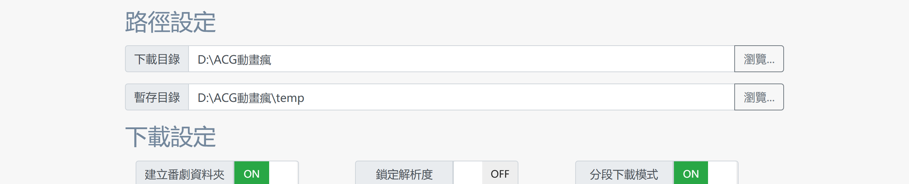
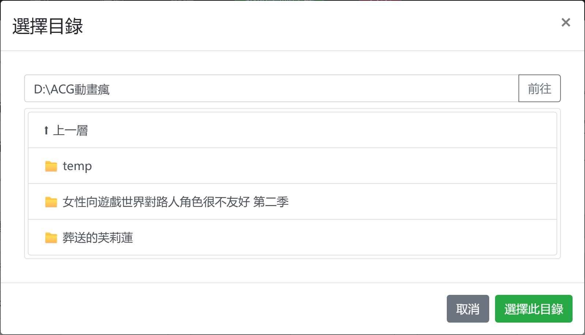
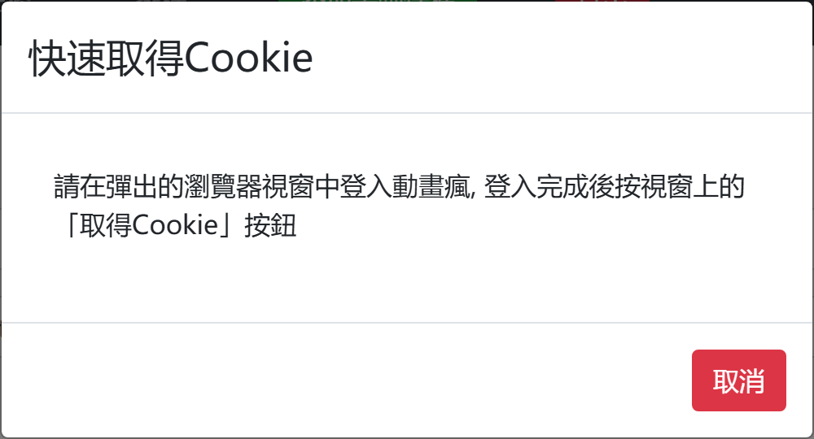
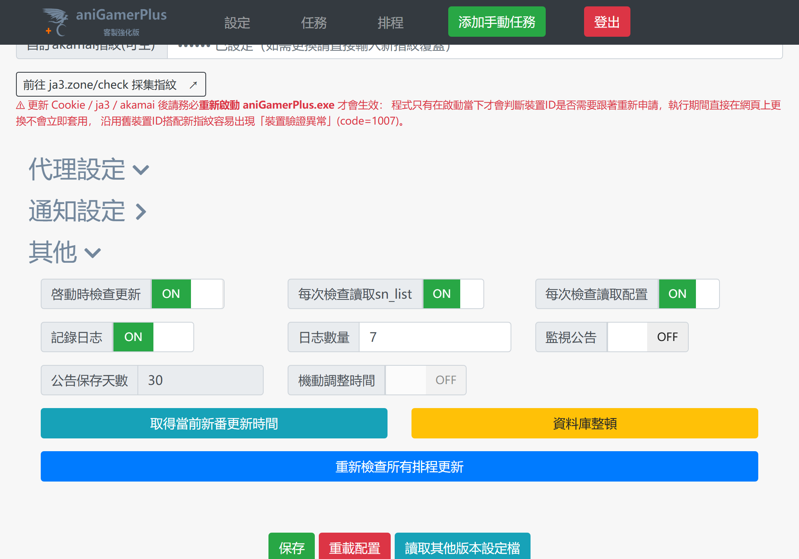

# 使用教學：aniGamer.db 資料庫化設定完整指南（v25.1.8 起適用）

> 自 **v25.1.8** 起，`config.json`、`sn_list.txt`、`cookie.txt`、`device_id.txt`、`dashboard_secret.key`、手動任務暫存檔全部整併進同一個 `aniGamer.db`（SQLite 資料庫），不再是各自獨立的純文字/JSON 檔案。<br>
> 這份文件專門說明「這個改變對使用上有什麼影響」，適合：<br>
> - 第一次使用本客製強化版的**新使用者**<br>
> - 從 v25.1.7 或更早版本升級上來的**舊使用者**<br>
> - 想要放棄本客製版、改回**官方版**的使用者
>
> 若想了解本客製版與官方 v24.6 的完整功能差異，請參閱 [README.md](README.md)；<br>
> 只想看 v25.1.8 這次版本的變更清單，請參閱 [RELEASE_NOTES_v25.1.8.md](../RELEASE_NOTES/RELEASE_NOTES_v25.1.8.md)。

---

## 目錄

- [開始之前：這個改變到底是什麼？](#開始之前這個改變到底是什麼)
- [一、全新使用者：從下載到開始追番](#一全新使用者從下載到開始追番)
- [二、舊使用者（v25.1.7 以前）：升級須知](#二舊使用者v25171以前升級須知)
- [三、啟動失敗、Port 被佔用怎麼辦：緊急修復檔案](#三啟動失敗port-被佔用怎麼辦緊急修復檔案)
- [四、想停用客製版、改回官方版：如何匯出設定檔](#四想停用客製版改回官方版如何匯出設定檔)
- [五、常見問題 FAQ](#五常見問題-faq)

---

## 開始之前：這個改變到底是什麼？

<table>
<tr><th>以前（v25.1.7 及更早）</th><th>現在（v25.1.8 起）</th></tr>
<tr>
<td valign="top">

`config.json`、`sn_list.txt`、`cookie.txt`、`device_id.txt`、`dashboard_secret.key`、`manual_single_tasks.json`、`manual_batch_tasks.json`，共 **7 個獨立檔案**散落在程式資料夾

</td>
<td valign="top">

全部整合進同一個 **`aniGamer.db`**，各自存在資料庫裡的一張表格中

</td>
</tr>
<tr>
<td valign="top">遇到斷電、當機或被強制關閉，若剛好寫到一半，檔案可能整個損毀成亂碼，導致設定或排程清單消失</td>
<td valign="top">所有讀寫都透過 SQLite 交易完成，不會再發生「寫一半就損毀」的情況</td>
</tr>
<tr>
<td valign="top">想改設定得直接編輯 <code>config.json</code>／<code>sn_list.txt</code></td>
<td valign="top">**一律透過 Web 控制臺（Dashboard）操作**，不需要、也不建議直接編輯資料庫</td>
</tr>
</table>

> ⚠️ **重要**：`aniGamer.db` 是二進位的 SQLite 資料庫檔案，**不能**用記事本等文字編輯器直接打開修改。<br>
> 所有設定都改成透過瀏覽器操作 Web 控制臺完成。

<details>
<summary>想知道更技術性的細節（驗證匯入邏輯、資料表結構等）？點此展開</summary>

- 第一次以 v25.1.8 啟動時，若偵測到硬碟上還有舊版的上述檔案，會自動檢查內容格式是否正常，**驗證通過才會匯入**資料庫；<br>
驗證失敗（例如檔案本身已經是亂碼）則不會匯入，改建立空白/預設值，避免把已經損毀的內容原封不動帶進資料庫。
- 匯入後，原始的舊檔案**不會被刪除或改名**，會繼續留在硬碟上，方便你自行確認新版本運作正常後再手動刪除（詳見〔[舊使用者升級須知](#二舊使用者v25171以前升級須知)〕）。
- 專案的 [`old/`](old) 資料夾仍保留官方原版格式的 `config-sample.json`／`sn_list-sample.txt` 作為格式參考，這兩個檔案**不會被程式讀取**，純粹只是留給需要對照官方格式的使用者查閱。

</details>

---

## 一、全新使用者：從下載到開始追番

### 1️⃣ 下載與解壓縮

從 [Releases](../../releases) 頁面下載打包好的壓縮檔並解壓縮到任意資料夾。<br>
解壓後至少要包含：

```
aniGamerPlus.exe        ← 主程式
Dashboard/               ← Web 控制臺網頁資源(不可缺少, 缺少會導致無法開啟設定頁面)
DanmuTemplate.ass        ← 彈幕字幕樣式範本(下載彈幕字幕需要, 缺少會下載失敗)
```

> ⚠️ **`ffmpeg.exe` 不需要自己準備**：下載影片實際上是靠 `ffmpeg` 合併每個片段，這個檔案體積較大（約 150MB），<br>
> 故意不包在發布的壓縮檔裡；程式啟動下載任務時，若系統 `PATH` 與 `aniGamerPlus.exe` 所在目錄都找不到，<br>
> 會自動從客製強化版的更新源下載一份放進程式所在目錄（v25.2.2 起新增），主控台/日誌會依序印出<br>
> 「缺少ffmpeg.exe」「正在下載ffmpeg.exe」「ffmpeg.exe已下載完成」三行訊息，全程不需要任何手動操作。
>
> 只有自動下載本身失敗時（例如網路環境連不到更新源），才需要自行到 [ffmpeg 官網](https://ffmpeg.org/download.html)下載，<br>
> 並選擇下面**其中一種**方式讓程式找得到它：<br>
> - 把 `ffmpeg.exe` 放進系統的環境變數 `PATH` 裡（一份就能給所有程式共用）；<br>
> 或<br>
> - 直接把 `ffmpeg.exe` 複製一份，跟 `aniGamerPlus.exe` 放在**同一個資料夾**裡
>
> 都沒有的話，開始下載時會出現「本項目依賴於ffmpeg, 但ffmpeg未找到」的錯誤。

> 📌 首次執行前**不需要**自己手動建立 `aniGamer.db`、`config.json` 或任何設定檔——程式第一次啟動時會自動產生所有必要的預設資料。

### 2️⃣ 執行主程式並開啟控制臺

直接雙擊 `aniGamerPlus.exe` 啟動。<br>
程式啟動後會在背景開啟 Web 控制臺伺服器，預設網址為：

```
http://localhost:5000
```

用瀏覽器打開這個網址即可看到登入畫面（若未啟用密碼保護會直接進入主畫面）：


### 3️⃣ 填寫基本設定

進入「設定」頁面後，依序完成下面兩塊最基本的設定：

<table>
<tr><td width="50%">

**路徑設定**：指定「下載目錄」（動畫存放位置）與「暫存目錄」，可直接輸入路徑，或按「瀏覽...」在伺服器端逐層挑選資料夾



</td><td width="50%">

**目錄瀏覽器**：點擊「瀏覽...」後可逐層瀏覽、選定路徑，不用自己手動輸入或猜測完整路徑



</td></tr>
</table>

接著到「環境偽裝設定」區塊，填寫 Cookie／JA3／Akamai（需要登入巴哈動畫瘋會員才能下載付費/會員限定內容時才必要）。<br>
**建議直接用「快速取得」按鈕**，不用自己開發者工具找 Cookie：



> 這些欄位存好後**都是直接寫進 `aniGamer.db`**，不會再產生 `cookie.txt`／`device_id.txt` 這些檔案。

填完後別忘了按「設定」頁最下方的「**保存**」按鈕，設定才會真正寫入資料庫生效。

### 4️⃣ 新增要追蹤的番劇（排程清單）

點擊導覽列的「**排程**」，會跳出一個文字方塊，用來輸入你想追蹤的番劇（一行一部），格式與過去的 `sn_list.txt` 完全相同：

```
sn碼 下載模式(可空) <重命名>(可空) *星期*(可空) $HH:MM$(可空) #注釋(可空)
```

例如：

```
49937 <女性向遊戲世界對路人角色很不友好 第二季> *五* $23:30$ # 每週五23:30才主動檢查
```

填好後按「提交」即會**直接存進資料庫**，不需要自己建立或編輯 `sn_list.txt`。<br>
完整語法說明（分類、下載模式、自訂星期/時間等）請參考 README 中的〔[`sn_list.txt` 排程功能強化](README.md#sn-list-schedule)〕章節，<br>
用法完全一致，只是儲存位置改成資料庫而已。

> 想先手動抓單一集數或整部作品試試看？可以改用導覽列「任務」→「添加手動任務」，貼上網址即可下載，不需要先加進排程清單。

至此，新使用者的基本設定就完成了。<br>
程式會依照「檢查頻率」設定，定期自動檢查排程清單中的番劇是否有更新並自動下載。

---

## 二、舊使用者（v25.1.7 以前）：升級須知

如果你原本就在使用舊版本（資料夾裡已經有 `config.json`／`sn_list.txt`／`cookie.txt` 等檔案），升級方式很單純：

1. **直接覆蓋替換**主程式 `aniGamerPlus.exe`（以及 `Dashboard` 資料夾）即可，不需要手動搬移或轉換任何設定。
2. 第一次以 v25.1.8 啟動時，程式會**自動偵測**這些舊檔案是否存在，逐一驗證內容格式沒有問題後，自動匯入 `aniGamer.db`。
3. 匯入完成後，原本的 `config.json`／`sn_list.txt` 等檔案會**繼續留在硬碟上**，不會被刪除或改名。

<details>
<summary>如何確認舊設定真的匯入成功了？</summary>

- 啟動時的主控台／日誌視窗會印出類似「偵測到舊版設定檔，已驗證並匯入資料庫」的訊息。
- 開啟 Web 控制臺「設定」頁，確認裡面顯示的路徑、Cookie 狀態（「已設定」）、排程清單等內容，跟你原本 `config.json`／`sn_list.txt` 裡的內容一致即可。
- 若某個舊檔案**驗證失敗**（例如剛好是先前斷電/當機造成的亂碼檔），該項目會改成空白/預設值匯入，不會把壞掉的內容帶進資料庫；<br>
這種情況下請直接在 Dashboard 裡重新填寫該項設定即可，不影響其他已成功匯入的項目。

</details>

<details>
<summary>什麼時候可以刪除舊的 config.json / sn_list.txt 等檔案？</summary>

程式**不會**自動幫你刪除或改名這些舊檔案，全部保留在原地。<br>
建議：

1. 確認 v25.1.8 已經正常運作一段時間（設定都還在、排程有正常抓到更新）。
2. 確認上述之後，再自行手動刪除舊的 `config.json`、`sn_list.txt`、`cookie.txt`、`device_id.txt`、`dashboard_secret.key`、`manual_single_tasks.json`、`manual_batch_tasks.json`。

因為這些舊檔案匯入後**不會再被程式讀取**（只有在對應資料庫表格是空的時候才會去檢查一次），留著也不影響運作，純粹是保留一份「證據」讓你自行確認後安心刪除。

</details>

---

## 三、啟動失敗、Port 被佔用怎麼辦：緊急修復檔案

設定改存進 `aniGamer.db` 後，一般使用者沒有工具能直接打開 SQLite 資料庫手動修改內容。<br>
萬一啟動時 Web 控制臺要用的 Port（預設 `5000`）被其他程式佔用，導致控制臺無法啟動，v25.1.8 新增了對應的修復機制：

1. 程式偵測到 Port 被佔用（重試 10 秒仍失敗）後，會在程式資料夾自動產生一個 **`emergency_fix.txt`**。
2. 用記事本打開它，裡面會清楚寫著目前的 `dashboard_port` 數值與修改說明：

   ```
   # aniGamerPlus 啟動異常修復用暫存檔案
   # 偵測到 Web 控制面板啟動失敗(port 被佔用), 請將下方 dashboard_port 改成目前沒有被佔用的數字(1~65535),
   # 存檔後重新啟動 aniGamerPlus.exe, 套用成功後這個檔案會被自動刪除
   dashboard_port=5000
   ```

3. 把 `dashboard_port=` 後面的數字改成任意 1~65535 之間、目前沒有被佔用的數字，存檔。
4. 重新啟動 `aniGamerPlus.exe`，程式會自動讀取這個檔案、驗證格式並套用到資料庫；<br>
**套用成功後這個檔案會被自動刪除**。
5. 若內容格式不合法（例如打錯字、數字超出範圍），檔案會被保留並在啟動訊息中提示錯誤原因，修正後再重啟一次即可。

> 這是目前唯一需要用文字編輯器介入的情境；<br>
> 其餘所有設定都建議透過 Web 控制臺操作。

---

## 四、想停用客製版、改回官方版：如何匯出設定檔

如果你之後想停止使用本客製版（資料庫儲存方式），改用官方 [miyouzi/aniGamerPlus](https://github.com/miyouzi/aniGamerPlus) 原版，可以把資料庫裡目前的設定重新匯出成一般的純文字檔案。

### 操作步驟

1. 開啟 Web 控制臺「設定」頁，捲動到「其他」區塊，「資料庫整頓」按鈕右側可以看到「**匯出設定與排程檔**」按鈕：

   

2. 按下後會先跳出提醒視窗：

   > 匯出的 `sn_list.txt` 與 `config.json` 是由資料庫重建而成，內容可能與原始檔案格式有些許差異，請下載後自行檢查再使用。<br>
   > 確定要匯出嗎?

3. 按下「確定」後，瀏覽器會依序下載兩個檔案：`sn_list.txt` 與 `config.json`。

### ⚠️ 匯出後務必注意的事

- **Cookie／裝置 ID 不包含在匯出檔案中**：`cookie.txt` 與 `device_id.txt` 因為安全性考量（Cookie 在 Dashboard 上一律遮罩顯示，<br>
不會有任何地方能讀出明文），匯出功能**不會**產生這兩個檔案。<br>
改用官方版後，請直接在官方版程式啟動一次讓它自動產生新的 `device_id.txt`，<br>
並自行從瀏覽器開發者工具重新複製一份 Cookie 存成官方版需要的 `cookie.txt`（或用本客製版「快速取得」功能先取得 Cookie 字串，再手動貼到官方版的 `cookie.txt`）。
- **內容是重建出來的，不是原始檔案**：匯出的 `config.json`／`sn_list.txt` 是程式即時把資料庫內容轉換回檔案格式產生的，建議下載後對照專案 [`old/`](old) 資料夾附的官方格式參考檔 [`config-sample.json`](old/config-sample.json)／[`sn_list-sample.txt`](old/sn_list-sample.txt)，確認 `bangumi_dir`、`temp_dir` 等關鍵欄位內容正確無誤。
- **本客製版特有的欄位**（例如 `ja3`／`akamai`、監視公告相關設定）在官方版中不會被使用，直接保留在檔案裡也不會造成錯誤，官方版程式會忽略它不認得的欄位。
- 把下載好的 `config.json`／`sn_list.txt` 放進官方版程式資料夾（取代它原本的同名檔案）即可。

---

## 五、常見問題 FAQ

<details>
<summary><strong>Q: 下載一開始就失敗，錯誤訊息說「本項目依賴於ffmpeg, 但ffmpeg未找到」怎麼辦？</strong></summary>

程式下載影片時是透過 `ffmpeg` 把逐段影片合併成完整檔案，這個工具**不包含在發布的壓縮檔裡**（體積約 150MB，故意不隨程式一起發布）。<br>
偵測到缺少時（v25.2.2 起）會自動從客製強化版的更新源下載一份放進程式所在目錄，通常不需要手動處理；<br>
會看到這個錯誤，代表自動下載本身也失敗了（例如網路環境連不到更新源）。<br>
請自行到 [ffmpeg 官網](https://ffmpeg.org/download.html)下載後，用以下**其中一種**方式讓程式找到它：

- 把 `ffmpeg.exe` 加進系統的環境變數 `PATH`；<br>
或
- 直接把 `ffmpeg.exe` 複製到跟 `aniGamerPlus.exe` **同一個資料夾**裡

程式啟動下載時會先嘗試從 `PATH` 找，找不到才會改看主程式所在資料夾並嘗試自動下載，任一種方式擇一即可。

</details>

<details>
<summary><strong>Q: aniGamer.db 存放在哪裡？可以備份嗎？</strong></summary>

`aniGamer.db` 位於主程式 `aniGamerPlus.exe` 所在的同一個資料夾。<br>
備份時只需要複製這一個檔案即可（連同 `Dashboard` 資料夾與 `DanmuTemplate.ass` 一起複製到新機器/新資料夾，就能完整還原所有設定、排程清單與 Cookie）。

</details>

<details>
<summary><strong>Q: 為什麼我看不到 config.json / sn_list.txt 了？是不是版本裝壞了？</strong></summary>

這是正常現象。<br>
v25.1.8 起這些檔案只在你原本就是舊使用者、且尚未完成自動匯入前才會存在並被讀取一次，<br>
之後所有設定都改存在 `aniGamer.db` 裡，程式不會再產生新的 `config.json`／`sn_list.txt`。<br>
全新安裝的使用者從頭到尾都不會看到這些檔案，這也是正常的。

</details>

<details>
<summary><strong>Q: 忘記 Dashboard 登入密碼，或者 Port 被佔用打不開設定頁，怎麼辦？</strong></summary>

- Port 被佔用：請參考上方〔[緊急修復檔案](#三啟動失敗port-被佔用怎麼辦緊急修復檔案)〕章節。
- 忘記密碼：目前沒有網頁端的忘記密碼流程，需要有資料庫操作經驗的使用者自行用 SQLite 工具清除 `dashboard_secret`／登入帳密相關資料表內容後重新設定；<br>
一般使用者建議尋求進階協助或直接反應在 Issue 上。

</details>

<details>
<summary><strong>Q: 換一台電腦使用，要怎麼搬家？</strong></summary>

複製以下三樣到新電腦的同一個資料夾即可：

- `aniGamerPlus.exe`
- `Dashboard/` 資料夾
- `aniGamer.db`（連同 `DanmuTemplate.ass`，若要繼續下載彈幕字幕）

不需要額外複製 `config.json`、`sn_list.txt` 等舊檔案（除非你當初升級後刻意保留、且新機器要重新走一次匯入流程）。

</details>

---

> 覺得本客製版對你有幫助的話，歡迎按下 Star⭐ 支持，也歡迎前往 [README.md](README.md) 了解完整功能差異與更新紀錄。
